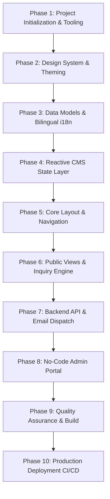

# 🏗️ Blueprint & Step-by-Step Plan: Building the TNSKA Web Platform from Scratch

This engineering document provides a complete, step-by-step master plan to build the **Tamil Nadu State Kudo Association (TNSKA)** web platform from zero to full production.

---

## 🗺️ High-Level Project Roadmap



---

## 📋 Phase 1: Project Initialization & Tooling

### 1.1 Technology Stack Rationale
- **Next.js 16 (App Router + Turbopack)**: Industry-standard React framework offering lightning-fast server-rendered performance, automatic static optimization, and unified API Route Handlers.
- **TypeScript 5 (Strict Mode)**: Guarantees end-to-end type safety across bilingual dictionaries, CMS records, and form payloads.
- **Tailwind CSS v4**: Utility-first CSS engine enabling rapid implementation of the Obsidian & Imperial Gold design system.
- **Lucide React**: Clean, modern, lightweight SVG icons.

### 1.2 Bootstrapping Commands
```bash
# 1. Initialize Next.js app with TypeScript and Tailwind CSS
npx -y create-next-app@latest tnska-website --typescript --tailwind --app --eslint --src-dir --import-alias "@/*" --use-npm

# 2. Navigate into project directory
cd tnska-website

# 3. Install core dependencies
npm install lucide-react clsx tailwind-merge
```

### 1.3 Target Directory Hierarchy
```
tnska-website/
├── public/                       # Logos, trust seals, favicon
├── src/
│   ├── app/
│   │   ├── api/
│   │   │   └── contact/
│   │   │       └── route.ts      # Server-side email & dispatch API
│   │   ├── contact/
│   │   │   └── page.tsx          # Standalone contact route
│   │   ├── globals.css           # Custom theme tokens & keyframes
│   │   ├── layout.tsx            # Root HTML & metadata wrapper
│   │   └── page.tsx              # Single-page application orchestrator
│   ├── components/
│   │   ├── AdminPanel.tsx        # Passcode-protected CMS interface
│   │   ├── Footer.tsx            # Footer & legal trust seals
│   │   ├── Header.tsx            # Sticky header, language toggle, mobile drawer
│   │   ├── Hero.tsx              # Cinematic hero section & quick actions
│   │   ├── HomeView.tsx          # Dynamic newsfeed, ticker, highlights
│   │   ├── LightboxModal.tsx     # Full-screen photo/gallery modal
│   │   ├── SearchModal.tsx       # Global search dialog
│   │   ├── TrustChain.tsx        # Affiliation trail (KIF -> KIFI -> TNSKA)
│   │   └── Views.tsx             # Modular views (About, Districts, Events, Contact, Media)
│   ├── context/
│   │   ├── AdminContext.tsx      # Reactive CMS provider + LocalStorage
│   │   └── LanguageContext.tsx   # Bilingual translation provider
│   └── data/
│       ├── dictionary.ts         # English & Tamil translations
│       └── kudoData.ts           # Initial seed data & interfaces
├── render.yaml                   # Infrastructure-as-code for Render
├── package.json
└── tsconfig.json
```

---

## 🎨 Phase 2: Design System & Theming

### 2.1 Color Palette Specifications
- **Obsidian Dark Surface**: `#09090b` (Background) / `#18181b` (Card Background)
- **Imperial Gold Primary**: `#f59e0b` / `#fbbf24` (Buttons, active states, glowing borders)
- **Deep Maroon Accent**: `#450a0a` / `#7f1d1d` (Badges, subtle background glow)
- **Executive Typography**: `#ffffff` (Headings) / `#e4e4e7` (Body text) / `#a1a1aa` (Muted labels)

### 2.2 Configure `src/app/globals.css`
Add custom gradient classes, glassmorphic backdrops, glowing borders, and smooth scrollbars:
```css
@import "tailwindcss";

@layer utilities {
  .gold-gradient-bg {
    background: linear-gradient(135deg, #f59e0b 0%, #d97706 50%, #b45309 100%);
  }
  .gold-text-gradient {
    background: linear-gradient(135deg, #fef08a 0%, #f59e0b 50%, #b45309 100%);
    -webkit-background-clip: text;
    -webkit-text-fill-color: transparent;
  }
  .card-hover {
    transition: all 0.3s cubic-bezier(0.4, 0, 0.2, 1);
  }
  .card-hover:hover {
    transform: translateY(-4px);
    box-shadow: 0 12px 28px -5px rgba(245, 158, 11, 0.15);
  }
}
```

---

## 📊 Phase 3: Data Architecture & Bilingual i18n

### 3.1 Define TypeScript Interfaces (`src/data/kudoData.ts`)
```typescript
export interface Academy {
  id: string;
  districtEn: string;
  districtTa: string;
  nameEn: string;
  nameTa: string;
  instructorEn: string;
  instructorTa: string;
  phone: string;
  addressEn: string;
  addressTa: string;
  mapUrl?: string; // Google Maps Location Link
}

export interface EventItem {
  id: string;
  titleEn: string;
  titleTa: string;
  date: string;
  venueEn: string;
  venueTa: string;
  isUpcoming: boolean;
  registrationLink?: string;
  rulesDocUrl?: string;
}

export interface DocumentItem {
  id: string;
  titleEn: string;
  category: 'Official Circular' | 'Governance & Constitution' | 'Rules & Syllabus' | 'Forms & Downloads';
  size: string;
  date: string;
  fileDataUrl?: string; // Real uploaded document base64 Data URL
}
```

### 3.2 Build Bilingual Dictionary (`src/data/dictionary.ts`)
Map all UI strings to both English (`en`) and Tamil (`ta`) to support seamless instant switching.

### 3.3 Create Language Provider (`src/context/LanguageContext.tsx`)
```typescript
'use client';
import React, { createContext, useContext, useState, useEffect } from 'react';
import { dictionary } from '@/data/dictionary';

type Language = 'en' | 'ta';

interface LanguageContextType {
  language: Language;
  setLanguage: (lang: Language) => void;
  t: typeof dictionary['en'];
}

const LanguageContext = createContext<LanguageContextType | undefined>(undefined);

export const LanguageProvider: React.FC<{ children: React.ReactNode }> = ({ children }) => {
  const [language, setLanguage] = useState<Language>('en');

  return (
    <LanguageContext.Provider value={{ language, setLanguage, t: dictionary[language] }}>
      {children}
    </LanguageContext.Provider>
  );
};

export const useLanguage = () => {
  const context = useContext(LanguageContext);
  if (!context) throw new Error('useLanguage must be used within LanguageProvider');
  return context;
};
```

---

## ⚙️ Phase 4: Reactive CMS State Layer (`AdminContext.tsx`)

### 4.1 State Management with LocalStorage Persistence
Create `src/context/AdminContext.tsx` to manage:
1. **News & Circulars State**
2. **Tournaments & Events State**
3. **District Academies State**
4. **Uploaded Documents State**
5. **Admin Authentication Session** (`kudo2026`)

### 4.2 CRUD Handlers
Provide reactive helper functions: `addNews`, `deleteNews`, `addEvent`, `deleteEvent`, `addAcademy`, `deleteAcademy`, `addDocument`, `deleteDocument`.

---

## 🖥️ Phase 5: Core Layout & Navigation Components

### 5.1 `Header.tsx`
- **Top Government & Affiliation Bar**: Trust badge + Language toggle button + Admin Portal trigger.
- **Brand Lockup**: TNSKA Gold crest emblem with bilingual association title.
- **Gapless Hover Dropdowns**:
  - `About TNSKA ▾` (Who We Are, History, Mission, Executive Committee).
  - `Events & Results ▾` (Tournaments, Medal Achievements).
  - `Media & Resources ▾` (Official Circulars, Photo Gallery).
- **Search Button**: Launches `SearchModal.tsx`.
- **Responsive Mobile Drawer**: Accordion navigation menu for tablet/smartphone viewports.

### 5.2 `TrustChain.tsx`
Visual 3-tier hierarchy cards explaining official lineage:
1. **Kudo International Federation (KIF) Japan** (World Governing Body)
2. **Kudo International Federation India (KIFI)** (National Governing Body)
3. **Tamil Nadu State Kudo Association (TNSKA)** (State Governing Body)

### 5.3 `Footer.tsx`
Secretariat address (Jawaharlal Nehru Stadium, Chennai), quick contact lines, SGFI recognition badge, social media links, and copyright disclaimer.

---

## 📱 Phase 6: Public Views & Interactive Modules (`Views.tsx` & `HomeView.tsx`)

### 6.1 `HomeView.tsx`
- **Hero Banner**: Video/image martial art banner with gold CTA buttons (`Find Dojo`, `Upcoming Events`).
- **Live Notice Ticker**: Instant highlight of the latest state championship or circular.
- **Leadership Messages**: Executive quotes from State President and General Secretary with official portraits.
- **Highlights Showcase**: Latest national and international medal victories.

### 6.2 `DistrictsView` (Academies & Google Maps Directions)
- Filter dropdown allowing users to select any of the 14+ districts (Chennai, Coimbatore, Madurai, Trichy, Salem, etc.).
- Academy cards showing Dojo Name, Chief Instructor, Contact Phone, and gold **`📍 GET DIRECTIONS`** button opening the custom Google Maps URL.

### 6.3 `ContactView` (Zero-Friction Inquiries Engine)
- **Theme-Matched Gold Validation**: `<form noValidate>` disables browser popups; invalid inputs glow with `border-amber-500 bg-amber-950/20` and show inline gold warnings (`Please fill in this field.`).
- **Generic Placeholders**: Clean standard placeholders (`Enter your full name`, `Enter your email address`, `+91 98400 00000`, `Enter inquiry subject`).
- **Anti-Spam Honeypot**: Hidden `website_hp` field filters automated bot submissions silently.
- **Direct Dispatch**: Uses `fetch('https://formsubmit.co/ajax/barathvr385@gmail.com')` from the client browser to bypass cloud server IP blocks, paired with `/api/contact` logging.

### 6.4 `MediaResourcesView` & `LightboxModal.tsx`
- **Downloadable Documents**: Category filters (Constitution, Belt Syllabi, Entry Forms) with direct download bindings.
- **Photo Gallery**: Grid of high-res action shots with full-screen zoom lightbox modal.

---

## 🔐 Phase 7: Backend API & Dispatch Engine (`/api/contact`)

Create `src/app/api/contact/route.ts` as a server-side route handler:
```typescript
import { NextResponse } from 'next/server';

export async function POST(req: Request) {
  try {
    const body = await req.json();
    const { name, email, phone, category, subject, message, website_hp } = body;

    // Honeypot bot protection
    if (website_hp) {
      return NextResponse.json({ success: true, message: 'Discarded bot submission' });
    }

    // Process inquiry logging or secondary email dispatch
    return NextResponse.json({ success: true, message: 'Inquiry processed successfully' });
  } catch (error) {
    return NextResponse.json({ success: false, error: 'Internal server error' }, { status: 500 });
  }
}
```

---

## 🛠️ Phase 8: No-Code Admin Portal (`AdminPanel.tsx`)

### 8.1 Authentication Guard
- Prompts for passcode (`kudo2026`).
- Stores authenticated state in `AdminContext`.

### 8.2 4-Tab Management Workspace
1. **News & Circulars Tab**: Form to add/remove state announcements.
2. **Tournaments & Events Tab**: Form to publish event dates, venues, registration links, and rulebooks.
3. **District Academies Tab**: Form to register new district dojos, Chief Senseis, and **Google Maps Navigation Links**.
4. **PDF Forms & Downloads Tab**:
   - File picker restricted to `.pdf`, `.doc`, `.docx`.
   - Max file size guard (15MB).
   - Converts file to base64 Data URL via `FileReader.readAsDataURL(file)` and binds it to the public download button.

---

## 🧪 Phase 9: Quality Assurance & Build Verification

### 9.1 TypeScript & Build Verification
```bash
# Verify TypeScript typing
npx tsc --noEmit

# Test production build bundle
npm run build
```

### 9.2 Verification Checklist
- [x] Language switcher updates all content smoothly.
- [x] District filter and "Get Directions" Google Maps links work.
- [x] Contact form validates empty fields in gold theme and submits inquiry to email.
- [x] Admin login (`kudo2026`) opens CMS and persists data.
- [x] Document uploader accepts `.pdf`/`.doc`/`.docx` and triggers file downloads.

---

## 🚀 Phase 10: Production Deployment & CI/CD (Render)

### 10.1 Create `render.yaml`
```yaml
services:
  - type: web
    name: tnska-website
    env: node
    plan: free
    buildCommand: npm run build
    startCommand: npm start
    envVars:
      - key: NODE_VERSION
        value: 20.10.0
```

### 10.2 Push to GitHub Repository
```bash
git init
git add .
git commit -m "Initial production release of TNSKA Web Platform"
git branch -M main
git remote add origin https://github.com/BARATH-VR/TamilNadu_Kudo_Website.git
git push -u origin main
```

*Render will automatically detect changes on the `main` branch, run the build script, and deploy the application live to your production URL.*
